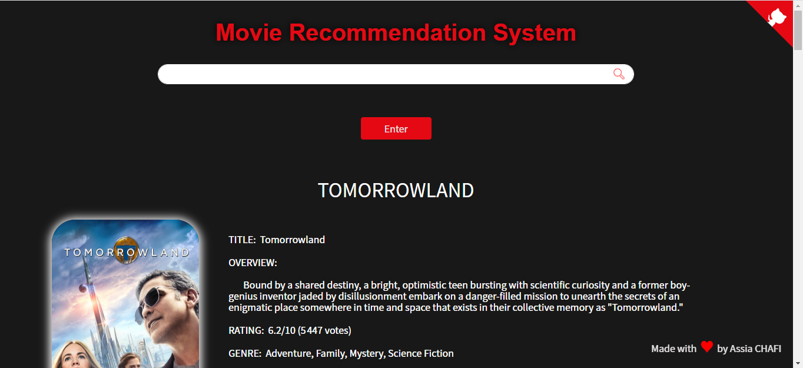
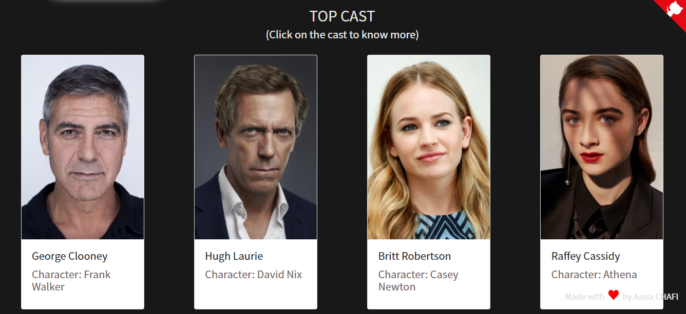
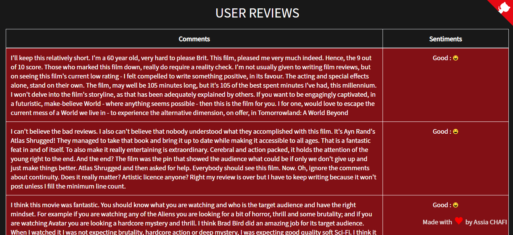
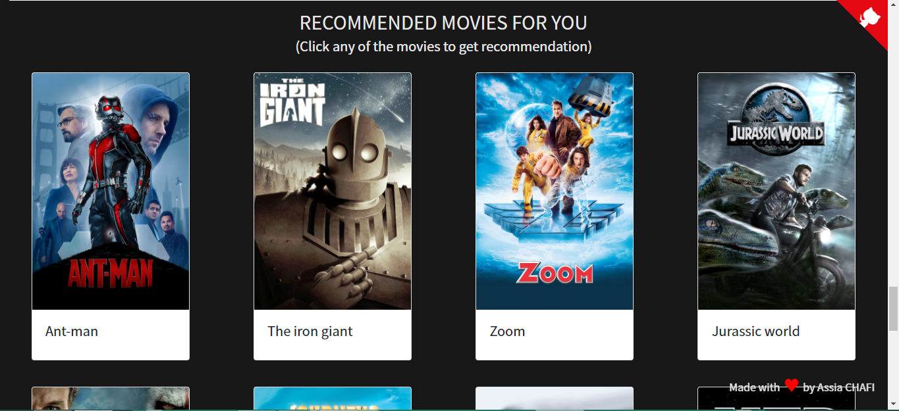

# Movie Recommender System and Reviews Sentiment Analysis

---

### Table of Contents

- [Description](#description)
- [How To Use](#how-to-use)
- [References](#references)

---

## Description
Content Based Recommender System recommends movies similar to the movie user likes and analyses the sentiments on the reviews given by the user for that movie.

The details of the movies(title, genre, runtime, rating, poster, etc) are fetched using an API by TMDB, https://www.themoviedb.org/documentation/api, and using the IMDB id of the movie in the API, I did web scraping to get the reviews given by the user in the IMDB site using beautifulsoup4 and performed sentiment analysis on those reviews.

Check out the live demo: ....
Link to this project report with youtube demo: .....

#### Technologies
- Web scraping (Beautifulsoup4)
- NLP : Reviews Sentiment Analysis
- Similarity Score : Find and recommend movies to the user
- Front End : Ajax, Html, css
- Web application framework : Flask

[Back To The Top](#Movie-Recommender-System-and-Reviews-Sentiment-Analysis)

---

## How To Use

1. Install all the libraries mentioned in the requirements.txt file.
2. Clone this repository in your local system.
3. Replace YOUR_API_KEY in the static/recommend.js file.
4. Open the command prompt from your project directory and run the command python main.py.

#### Sources of the datasets
- [Kaggle : IMDB 5000 Movie Dataset](https://www.kaggle.com/carolzhangdc/imdb-5000-movie-dataset)
- [Kaggle : The Movies Dataset](https://www.kaggle.com/rounakbanik/the-movies-dataset)
- [List of movies in 2018](https://en.wikipedia.org/wiki/List_of_American_films_of_2018)
- [List of movies in 2019](https://en.wikipedia.org/wiki/List_of_American_films_of_2019)
- [List of movies in 2020](https://en.wikipedia.org/wiki/List_of_American_films_of_2020)

[Back To The Top](#Movie-Recommender-System-and-Reviews-Sentiment-Analysis)

---

## Author Info

- Website - [Assia CHAFI](https://achafi.github.io/myportfolio/)

[Back To The Top](#Movie-Recommender-System-and-Reviews-Sentiment-Analysis)